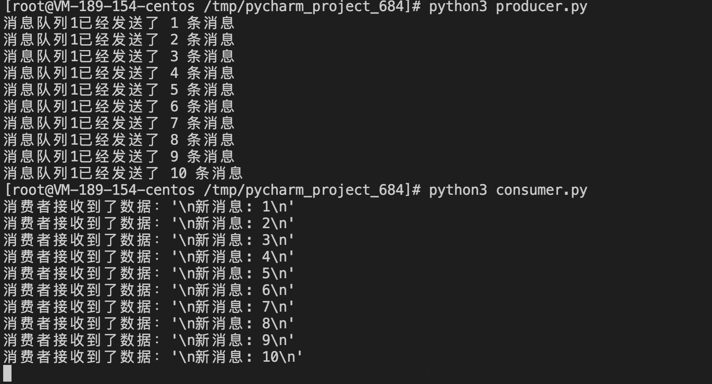
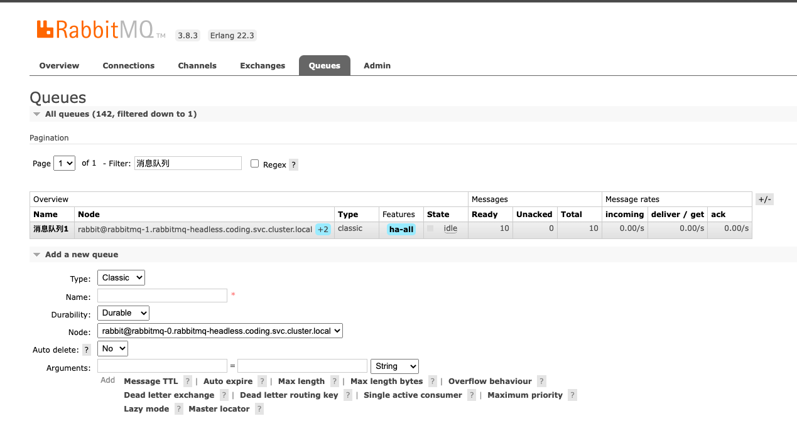
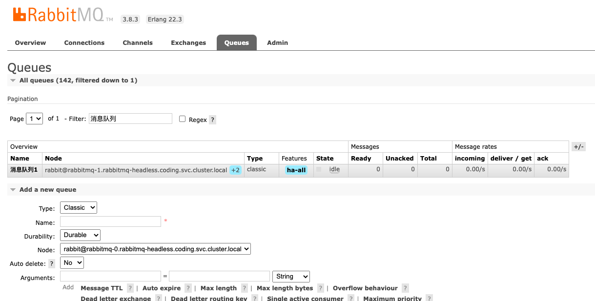

# Python3 模拟 RabbitMQ 生产和消费
用于验证和测试rabbitmq集群的可用性，快速定位生产问题


## 执行环境
```
- 安装 Python3
- 执行机可以正常访问到 rabbitmq 服务器
```
## 安装依赖
```shell
pip3 install -r requirements.txt
```

## 工具介绍
```shell
producer.py # 模拟生产者发送消息
consumer.py # 模拟消费者接受消息
```

## 配置说明
```shell
hostname = "x.x.x.x"  # rabbitmq 服务器地址
port = 5672           # rabbitmq 服务器端口
username = "guest"    # rabbitmq 服务器账号
password = "guest"    # rabbitmq 服务器密码
queues_key = "消息队列1"  # 测试队列名称,可以随意定义
count = 10  # 生产者发送消息数目

# 注意: 生产者和消费者的配置必须一致
```

## 执行说明
```shell
python3 producer.py  # 生产任务
python3 consumer.py  # 消费任务
```


## 查看方式
登录 rabbitmq 内置UI控制台，查看队列消息数目变化.
执行生产任务，未消费可以看到消息数目和实际测试产生的一致

执行生产任务，消费后可以看到消息数目为空

